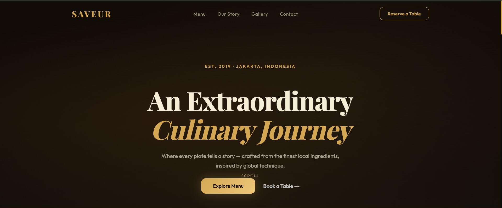

# 🍽️ Saveur — Fine Dining Restaurant Landing Page

## 📌 Deskripsi

**Saveur** adalah landing page website restoran fine dining dengan desain modern, elegan, dan responsif.
Project ini dibuat untuk menampilkan pengalaman UI/UX premium dengan fokus pada visual, animasi, dan interaksi pengguna.

---

## ✨ Fitur Utama

* 🎨 **Modern UI Design** (fine dining aesthetic)
* 📱 **Fully Responsive** (mobile, tablet, desktop)
* ⚡ **Smooth Scrolling & Animations**
* 🍽️ **Menu Showcase Section**
* 🖼️ **Gallery Grid Layout**
* 📅 **Reservation Form (UI Only)**
* 📍 **Contact & Location Section**
* 🌟 **Interactive Elements (hover, scroll effect)**

---

## 🛠️ Tech Stack

* HTML5
* CSS3 (Custom styling, no framework)
* JavaScript (Vanilla JS)

---

## 📷 Preview




---

## 🚀 Cara Menjalankan Project
1. Clone repository:

```bash
git clone https://github.com/username/Restaurant_landing.git
```

2. Masuk ke folder project:

```bash
cd Restaurant_landing
```

3. Buka file `index.html` di browser


🎯 Tujuan Project
Project ini dibuat untuk:

* Melatih kemampuan **Frontend Development**
* Mengasah skill **UI/UX Design**
* Membuat **portfolio project yang siap ditampilkan ke recruiter**

📌 Highlight
* Desain menggunakan konsep **luxury & fine dining**
* Menggunakan **custom CSS (tanpa Bootstrap/Tailwind)**
* Fokus pada **detail visual dan experience pengguna**

👤 Author
Fauzi Ridho Anshori

💡 Catatan
Project ini hanya berfokus pada **frontend (UI/UX)** dan belum terhubung ke backend.
